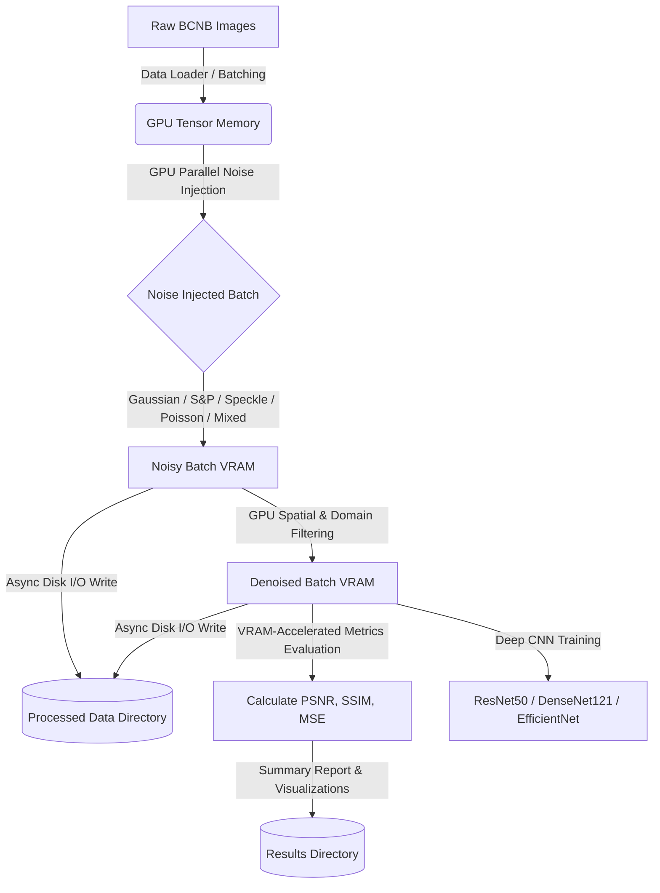

# Core Needle Biopsy (CNB) AI Model Project

[](https://pytorch.org/)
[](https://developer.nvidia.com/cuda-zone)
[](LICENSE)
[](#)

A high-performance, GPU-accelerated deep learning and image processing pipeline designed for classification and quality optimization of breast cancer histopathology images obtained from **Core Needle Biopsy (CNB)** Whole Slide Images (WSIs). 

The system simulates clinical and scanning artifacts by injecting various synthetic noise distributions and evaluates the performance of multiple state-of-the-art denoising filters to determine the optimal preprocessing combination for robust histopathological classification.

---

## 📌 Table of Contents
1. [Project Overview](#-project-overview)
2. [Problem Statement & Objectives](#-problem-statement--objectives)
3. [Preprocessing & Evaluation Matrix](#-preprocessing--evaluation-matrix)
4. [System Architecture](#-system-architecture)
5. [Project Structure](#-project-structure)
6. [Getting Started & Installation](#-getting-started--installation)
7. [Configuration Management](#-configuration-management)
8. [Running the Pipeline](#-running-the-pipeline)
9. [Docker Deployment](#-docker-deployment)
10. [Unit Testing](#-unit-testing)
11. [Expected Outputs & Deliverables](#-expected-outputs--deliverables)
12. [Future Roadmap](#-future-roadmap)

---

## 🔍 Project Overview

Digital pathology workflows face significant challenges due to image quality degradations. During tissue preparation, slide staining, scanner acquisition, compression, and digital transmission, multiple types of noise are introduced. These artifacts negatively affect downstream AI diagnostics. 

This repository provides an **end-to-end framework** to:
1. **Load** BCNB Whole Slide Image patches.
2. **Inject** realistic synthetic noise models (Gaussian, Salt & Pepper, Poisson, Speckle, Mixed).
3. **Denoise** using GPU-accelerated spatial and statistical filters.
4. **Train and evaluate** deep CNN models (e.g., ResNet50, DenseNet121, EfficientNet) to quantify the impact of different image restoration filters on diagnostic classification accuracy.

---

## 🎯 Problem Statement & Objectives

### The Challenge
Histopathological images suffer from clinical and technical noise that alters structural features (e.g., cell borders, nuclear atypia, mitotic figures), reducing the generalization and accuracy of deep-learning-based classification models. 

### Core Objectives
* **Pipeline Standardization:** Build a fully reproducible, configurations-driven AI pipeline for breast cancer histopathology.
* **Degradation Simulation:** Benchmarking against five distinct mathematical noise models.
* **GPU Filtering:** Execute and compare eight spatial/domain denoising filters in parallel.
* **Model Optimization:** Identify the optimal *Noise-to-Filter* preprocessing configuration that maximizes CNN-based tumor classification metrics.

---

## 📊 Preprocessing & Evaluation Matrix

The pipeline executes a full combinatorial matrix: **5 Noise Types × 8 Denoising Filters = 40 distinct preprocessing experiments** per image.

| Noise Model | Description | Primary Targets | Applied Filters |
| :--- | :--- | :--- | :--- |
| **Gaussian** | Additive Gaussian noise (Sensor thermal noise) | High-frequency noise | Median, Gaussian, Wiener, Bilateral, Non-Local Means (NLM), Anscombe + Wiener, Adaptive Median, Kuan |
| **Salt & Pepper** | Random impulse noise (Transmission errors) | Dead/hot pixels | Median, Gaussian, Wiener, Bilateral, NLM, Anscombe + Wiener, Adaptive Median, Kuan |
| **Speckle** | Multiplicative noise (Coherent imaging/artifacts) | Structural textures | Median, Gaussian, Wiener, Bilateral, NLM, Anscombe + Wiener, Adaptive Median, Kuan |
| **Poisson** | Photon shot noise (Low-light scanning conditions) | Darker tissue regions | Median, Gaussian, Wiener, Bilateral, NLM, Anscombe + Wiener, Adaptive Median, Kuan |
| **Mixed** | Combined Poisson + Gaussian noise (Realistic scanner noise) | General pathology scan | Median, Gaussian, Wiener, Bilateral, NLM, Anscombe + Wiener, Adaptive Median, Kuan |

---

## ⚙️ System Architecture

The pipeline leverages PyTorch tensor operations and custom GPU kernels (in `src/model_gpu.py`) to keep processing fully inside VRAM, avoiding slow GPU-to-CPU host transfers.



---

## 📂 Project Structure

The project code is modularized in the `cnb/` directory:

```bash
c:/Users/swapn/Project/Manjiri/
├── README.md                 # Root documentation (this file)
└── cnb/                      # Core Needle Biopsy AI Project Directory
    ├── .dockerignore         # Docker exclusion configuration
    ├── .gitignore            # Git exclusion rules
    ├── Dockerfile            # CPU deployment container
    ├── Dockerfile.gpu        # High-performance CUDA/GPU container
    ├── requirements-gpu.txt  # Python environment dependencies
    ├── prd.md                # Product Requirements Document
    ├── project-structure.md  # Extended project layout documentation
    ├── config/
    │   └── config.yaml       # Hyperparameters, noise coefficients, and paths
    ├── src/
    │   ├── __init__.py       # Package initializer
    │   ├── data_loader.py    # Batched PyTorch datasets & memory-pinning load
    │   ├── engine_gpu.py     # GPU orchestrator, batch pipeline, and metric plots
    │   ├── model_gpu.py      # CUDA-accelerated noise injection & filter models
    │   └── utils.py          # Metrics (MSE, PSNR, SSIM) & plotting utils
    └── tests/
        ├── __init__.py       # Test package setup
        └── test_model.py     # Unit testing suite
```

---

## 🚀 Getting Started & Installation

### Prerequisites
* **Operating System:** Windows 10/11 or Linux
* **Python Version:** Python 3.10+
* **CUDA Hardware:** NVIDIA GPU with CUDA Compute Capability >= 7.0 (Recommended)
* **CUDA Toolkit:** CUDA 12.4+ (matches PyTorch configuration)

### Installation
Clone this repository and navigate to the project directory:

```bash
git clone <repository-url>
cd Manjiri/cnb
```

Create a virtual environment and install the required dependencies:

```bash
# Create virtual environment
python -m venv venv
source venv/Scripts/activate # On Windows: venv\Scripts\activate

# Install PyTorch with CUDA support (adjust version if needed)
pip install torch torchvision --index-url https://download.pytorch.org/whl/cu124

# Install other package dependencies
pip install -r requirements-gpu.txt
```

---

## 🔧 Configuration Management

All settings, parameters, and hyperparameters are managed through [config.yaml](file:///c:/Users/swapn/Project/Manjiri/cnb/config/config.yaml).

Important blocks in `config.yaml`:
```yaml
dataset:
  image_size: [224, 224]      # Output resolution
  batch_size: 32              # VRAM batch processing size
  num_workers: 4              # CPU data loaders threads

noise:
  gaussian: { var: 0.01 }     # Noise settings
  sp: { amount: 0.05 }
  speckle: { var: 0.04 }

denoising:
  bilateral: { d: 9, sigma_color: 75.0, sigma_space: 75.0 }
  non_local_means: { h: 10, template_window_size: 7, search_window_size: 21 }

model:
  backbone: "resnet50"        # Classifier backbone
```

---

## 🏃 Running the Pipeline

To run the pipeline and run batch noise-filter processing on your dataset, place your raw images in the configured raw data folder (e.g., `data/raw/BCNB/`) and run:

```bash
# Execute GPU-accelerated preprocessing pipeline
python -m src.engine_gpu
```

### Script Execution Parameters
You can adjust the behavior directly in [engine_gpu.py](file:///c:/Users/swapn/Project/Manjiri/cnb/src/engine_gpu.py) or specify execution variables:
* **`max_images`:** Limits the number of images processed (useful for rapid testing / development).
* **`batch_size`:** Scales parallel processing batches to prevent GPU out-of-memory (OOM) errors.

---

## 🐳 Docker Deployment

The application is containerized with separate profiles for standard (CPU) environments and hardware-accelerated (GPU) platforms.

### Build and Run with GPU Acceleration (CUDA)

```bash
# Build CUDA container
docker build -t cnb-ai-gpu -f Dockerfile.gpu .

# Run container with access to NVIDIA GPUs:

# Linux/macOS (Bash/Zsh):
docker run --gpus all -v $(pwd)/data:/app/data -v $(pwd)/results:/app/results cnb-ai-gpu

# Windows (Command Prompt - CMD):
docker run --gpus all -v "%cd%/data:/app/data" -v "%cd%/results:/app/results" cnb-ai-gpu

# Windows (PowerShell):
docker run --gpus all -v "${PWD}/data:/app/data" -v "${PWD}/results:/app/results" cnb-ai-gpu
```

---

## 🧪 Unit Testing

Ensure implementation integrity of the noise generation and filter methods by executing the test suite:

```bash
python -m unittest discover -s tests -p "test_*.py"
```

---

## 📈 Expected Outputs & Deliverables

After the pipeline finishes executing, the following structures will be populated in the root workspace directories:

* **`data/processed/`**: Contains generated subdirectories (`noisy/` and `denoised/`) holding processed images.
* **`results/final_results.csv` & `final_results.xlsx`**: Detailed output tracking every noise-filter variant metrics per image.
* **`results/summary_statistics.csv`**: Consolidated PSNR, SSIM, and MSE values across all 40 configuration combinations.
* **`results/psnr_comparison.png` & `ssim_comparison.png`**: Automatically generated bar plots analyzing filter performance across noise models.
* **`results/sample_denoising_result.png`**: Side-by-side visual matrix highlighting the *Original*, *Noisy*, and *Denoised* states of a sample histopathology patch.

---

## 🗺️ Future Roadmap

* [ ] Integrate Whole Slide Image (WSI) patch extraction scripts.
* [ ] Integrate attention-based Multiple Instance Learning (MIL) model training.
* [ ] Support Explainable AI activations via Grad-CAM / Score-CAM.
* [ ] Integrate Optuna for automated filter hyperparameter tuning.
* [ ] Develop a web-based interactive inference dashboard using FastAPI and Streamlit.